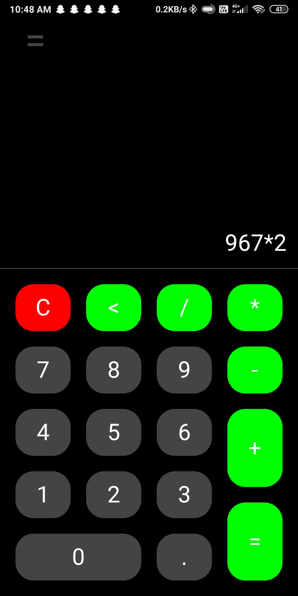

# **Calculater**  

_A simple calculator app built with Jetpack Compose._  

## 📷 Screenshots




## 🚀 Features  

✅ Basic arithmetic operations (+, -, *, /)  
✅ Clean and minimal UI  
✅ Uses **exp4j** for expression evaluation  
✅ History tab to store previous equations

## 🛠️ Installation  

1. **Download the latest release** [here](https://github.com/Ankumeah/Calculater/releases) **OR**  
2. **Build from source:**  
   - Clone the repository:  
     ```sh
     git clone https://github.com/Ankumeah/Calculater.git
     ```
   - Open the project in **Android Studio**  
   - Run the app on an **emulator** or **real device**  

## 🤝 Contributing  

This project has 2 contributers - 

The owner and developer - [Ankumeah](https://github.com/Ankumeah/) 

**and** 

The designer - Decian Studios ©

While we appreciate any **suggestions**, We will not be implementing code changes from others. However, feel free to suggest **new features**!  

## ⚖️ License  

This project is licensed under the **MIT License**. See the [LICENSE](LICENSE) file for details.

